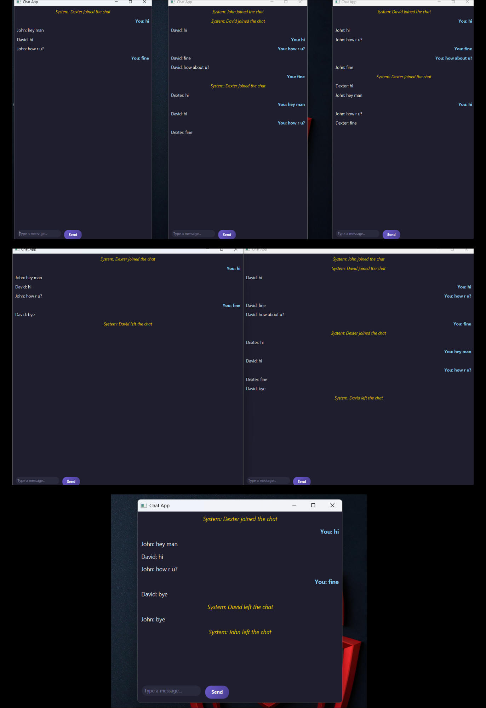

# Chat Application (Java + JavaFX)

## 📖 Overview
This project is a **real-time chat application** built using **Java, JavaFX, and Socket Programming**.  
It allows multiple users to connect to a server and exchange messages securely.  
The application includes a **dark theme (Telegram-like)** interface for a modern look.

## ✨ Features
- Real-time client–server messaging  
- Multiple clients can connect to one server  
- User-friendly JavaFX GUI with dark theme  
- Distinction between "You" and other users  
- Secure communication using AES encryption  

## 🛠️ What I Have Done
- Designed and implemented a **server–client architecture** using Java Sockets  
- Built a **JavaFX UI** with a violet-black theme and white text  
- Added **nickname support** so each user is identified uniquely  
- Configured **Maven project structure** with dependencies for JavaFX and Gson  
- Implemented **AES-based encryption utility** for secure message transfer  

## ⚡ How to Run
1️⃣ Start the Server: mvn exec:java -Dexec.mainClass="chat.server.ChatServer"
2️⃣ Start the Client: mvn exec:java -Dexec.mainClass="chat.client.UI"

👉 Run the server in one terminal and open multiple client windows in separate terminals to simulate chat between users.

## 📷 Output

Here is a sample screenshot of the chat application:

